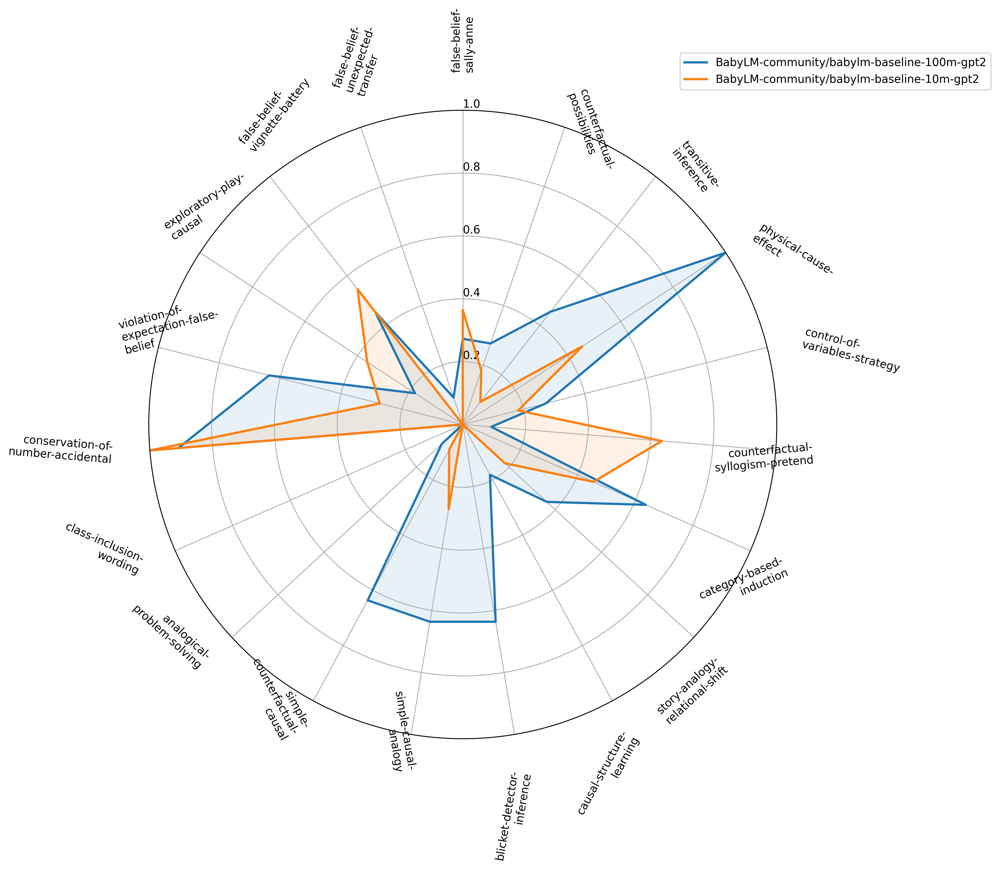

# BabyReasoningBench: Generating Developmentally-Inspired Reasoning Tasks for Evaluating Baby Language Models

BabyReasoningBench is a benchmark suite of developmentally inspired reasoning tasks designed to evaluate baby language models.

## Tasks Covered

| Task |
| --- |
| Baron Cohen Sally Anne False Belief |
| Beck Counterfactual Possibilities |
| Bryant Trabasso Transitive Inference |
| Bullock Gelman Baillargeon Causal Reasoning |
| Chen Klahr Control Of Variables |
| Dias Harris Counterfactual Syllogism |
| Gelman Markman Category Induction |
| Gentner Toupin Story Analogy |
| Gopnik Causal Learning Bayes Nets |
| Gopnik Sobel Blicket Detector |
| Goswami Brown Causal Analogy |
| Harris German Mills Counterfactual Causal |
| Holyoak Junn Billman Analogical Problem Solving |
| Markman Seibert Class Inclusion |
| McGarrigle Donaldson Conservation Accidents |
| Onishi Baillargeon Violation Of Expectation |
| Schulz Bonawitz Exploratory Play |
| Wellman Cross Watson False Belief Battery |
| Wimmer Perner False Belief Unexpected Transfer |

## Model Performance of Baby LMs



## Citation

If you use BabyReasoningBench, please cite:

```bibtex
@misc{dhole2026babyreasoningbenchgeneratingdevelopmentallyinspiredreasoning,
      title={BabyReasoningBench: Generating Developmentally-Inspired Reasoning Tasks for Evaluating Baby Language Models}, 
      author={Kaustubh D. Dhole},
      year={2026},
      eprint={2601.18933},
      archivePrefix={arXiv},
      primaryClass={cs.CL},
      url={https://arxiv.org/abs/2601.18933}, 
}
```
